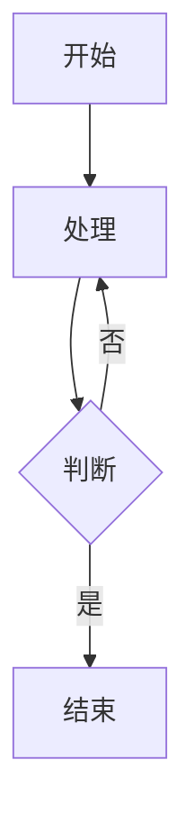

# Github Markdown 文档示例
## 列表
### 代码
```md
- 项目1
- 项目2
  * 项目2.1
  * 项目2.2
+ 项目4
+ 项目5
```
### 样式
- 项目1
- 项目2
  * 项目2.1
  * 项目2.2
+ 项目4
+ 项目5

## 表格
### 代码
```md
| 项目名称 | 技术栈        | 描述               | 状态   |
|----------|--------------|--------------------|--------|
| 项目A     | ASP.NET      | 后端服务开发        | ✅ 完成 |
| 项目B     | HTML/CSS/JS  | 前端页面练习        | 🚧 进行中 |
| 项目C     | C# + WPF     | 桌面应用            | ❌ 未开始 |
```
### 样式
| 项目名称 | 技术栈        | 描述               | 状态   |
|----------|--------------|--------------------|--------|
| 项目A     | ASP.NET      | 后端服务开发        | ✅ 完成 |
| 项目B     | HTML/CSS/JS  | 前端页面练习        | 🚧 进行中 |
| 项目C     | C# + WPF     | 桌面应用            | ❌ 未开始 |

## 链接
### 代码
```md
[Google](https://www.google.com)
[相对路径](./README.md)
```
### 样式
[Google](https://www.google.com)
[相对路径](./README.md)

## 图形
### 代码
```md

```
### 样式


## 数学显示
### 代码
```md
行内公式：$`E = mc^2`$

块级公式：
\\是换行
$`\begin{equation}\begin{aligned}
& \text{1. } \int\limits_{a}^{a} f(x)dx = 0\\
& \text{2. } \int\limits_{a}^{a} f(x)dx = -\int\limits_{a}^{a} f(x)dx\\
& \text{3. } \int\limits_{a}^{b}[\alpha f(x) + \beta g(x)]dx = \alpha \int\limits_{a}^{b} f(x)dx + \beta \int\limits_{a}^{b} g(x)dx \text{ con } \alpha ,\beta \in R\\
& \text{4. } \int\limits_{a}^{b} f(x)dx = \int\limits_{a}^{c} f(x)dx + \int\limits_{a}^{b} f(x)dx \text{ con } c \in [a; b]\\
\end{aligned}\end{equation}`$
```
### 样式
行内公式：$`E = mc^2`$

块级公式：
$`\begin{equation}\begin{aligned}
& \text{1. } \int\limits_{a}^{a} f(x)dx = 0\\
& \text{2. } \int\limits_{a}^{a} f(x)dx = -\int\limits_{a}^{a} f(x)dx\\
& \text{3. } \int\limits_{a}^{b}[\alpha f(x) + \beta g(x)]dx = \alpha \int\limits_{a}^{b} f(x)dx + \beta \int\limits_{a}^{b} g(x)dx \text{ con } \alpha ,\beta \in R\\
& \text{4. } \int\limits_{a}^{b} f(x)dx = \int\limits_{a}^{c} f(x)dx + \int\limits_{a}^{b} f(x)dx \text{ con } c \in [a; b]\\
\end{aligned}\end{equation}`$

## Mermaid
### 代码
```md
graph TD
A[开始] --> B[处理]
B --> C{判断}
C -->|是| D[结束]
C -->|否| B
```

### 样式


